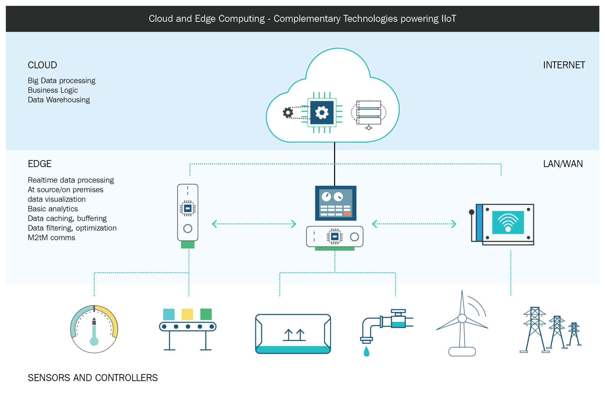

# Rest API for Edge Computing

## Todo

- [x] Rest API with Actix
- [x] Connect to PostgreSQL
- [x] Integration tests
- [ ] Implement CRUD in DB
- [ ] Authentication (JWT or Cert)
- [ ] Handle errors
- [ ] Unit tests
- [ ] Benchmarking
- [ ] Logging

## Getting Started
